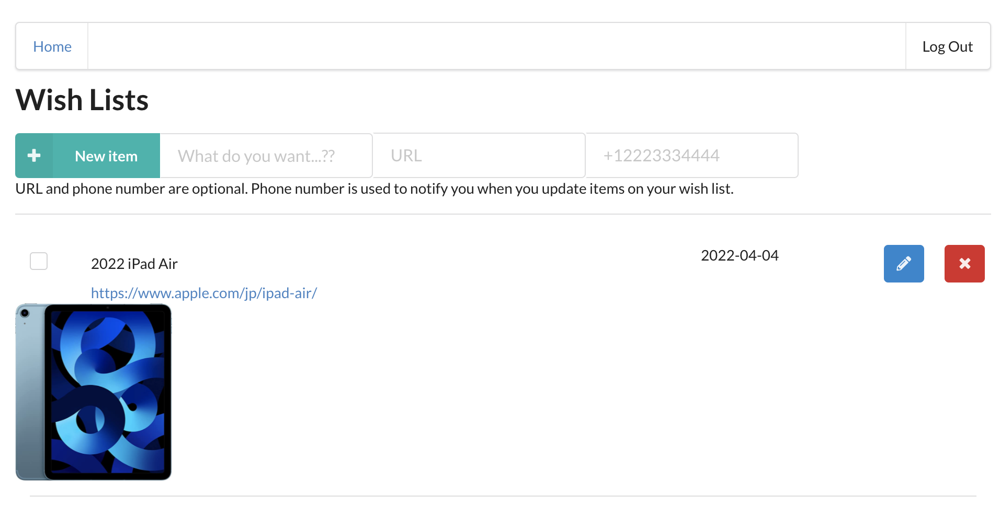

# Serverless Wish list

This is a serverless application to create your wish list using AWS Lambda and Serverless framework.



## Functionality of the application

This application will allow creating/removing/updating/fetching wish list items. Each wish list item can optionally have an attachment image. Each user only has access to wish list items that he/she has created.

## Wish list items

The application should store wish list items, and each wish list item contains the following fields:

- `itemId` (string) - a unique id for a wish list item
- `createdAt` (string) - date and time when a wish list item was created
- `name` (string) - name of a wish list item (e.g. "PlayStation 5")
- `dueDate` (string) - date and time by which a wish list item should be completed
- `done` (boolean) - true if a wish list item was gotten, false otherwise
- `url` (string) (optional) - a URL pointing to information of a wish list item
- `attachmentUrl` (string) (optional) - a URL pointing to an image attached to a wish list item

You might also store an id of a user who created a wish list item.

## Prerequisites

- <a href="https://manage.auth0.com/" target="_blank">Auth0 account</a>
- <a href="https://github.com" target="_blank">GitHub account</a>
- <a href="https://nodejs.org/en/download/package-manager/" target="_blank">NodeJS</a> version up to 12.xx
- Serverless
  - Create a <a href="https://dashboard.serverless.com/" target="_blank">Serverless account</a> user
  - Install the Serverless Framework’s CLI (up to VERSION=2.21.1). Refer to the <a href="https://www.serverless.com/framework/docs/getting-started/" target="_blank">official documentation</a> for more help.
  ```bash
  npm install -g serverless@2.21.1
  serverless --version
  ```
  - Configure serverless to use the AWS credentials
  ```bash
  sls config credentials --provider aws --key YOUR_ACCESS_KEY_ID --secret YOUR_SECRET_KEY --profile serverless
  ```

## How to run the application

### Backend

To deploy an application run the following commands:

```
cd backend
npm install
sls deploy -v
```

### Frontend

To run a client application first edit the `client/src/config.ts` file to set correct parameters. And then run the following commands:

```
cd client
npm install
npm run start
```

This should start a development server with the React application that will interact with the serverless wish list application.

## Postman collection

An alternative way to test your API, you can use the Postman collection that contains sample requests. You can find a Postman collection in this project.
